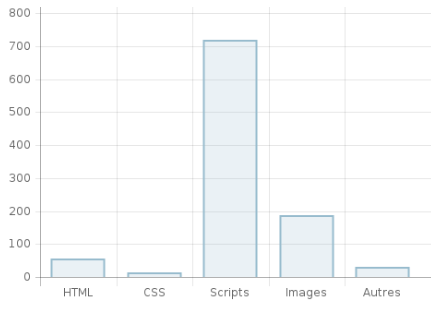

# Performance Audits

## Introduction
We will present performance audits both for our todo list web app and one of our concurrent: [todolistme.net](http://todolistme.net/).
Based on results, we will formulate some recommandations and grasp some insights we could use for our own web app.

## Audits environment
Performance audits will be conducted with the following tools:
- Chrome dev tools in private mode
- [Dareboost](https://www.dareboost.com/)

We will also use Network dev tools inspector to investigate the content and duration of each requests.

### Chrome dev tools configuration
We will run performance audits for desktop device without network throttling.

## Performance Audits

### Metrics

 |**Our Todo List App**|**Todolisme.net**
:-----:|:-----:|:-----:
Devtools score (/100)|97|37
First contentful paint (s)|1.6|1.6
First meaningful paint (s)|1.6|13.3
Speed index (s)|1.7|5
First CPU idle (s)|3.2|24.3
Time to interactive (s)|3.2|31.5
Max potential first input delay (ms)|100|2460

*Caption*
First Contentful Paint marks the time at which the first text or image is painted.  
First Meaningful Paint measures when the primary content of a page is visible.  
Speed Index shows how quickly the contents of a page are visibly populated.  
First CPU Idle marks the first time at which the page's main thread is quiet enough to handle input.  
Time to interactive is the amount of time it takes for the page to become fully interactive.  
The maximum potential First Input Delay that your users could experience is the duration, in milliseconds, of the longest task.

*Size distribution - Todolisme.net*

*Number of requests distibution - Todolisme.net*

### Analysis

### Recommandations

### Insights

<!-- ## Our TODO LIST app

### Recommandations
Performance
Serve static assets with an efficient cache policy

## TodoListMe.net

### Recommandations
Performance
Ensure text remains visible during webfont load
Reduce the impact of third-party code Third-party code blocked the main thread for 1,330 ms (14 third-parties identified)
Minimize main-thread work 8.9 s
Serve static assets with an efficient cache policy 29 resources found
Reduce JavaScript execution time 4.7 s -->

