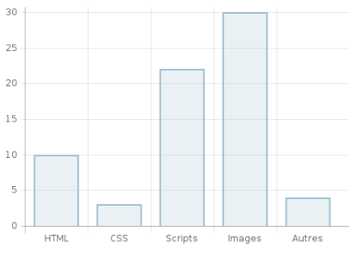

# Performance Audits

## Introduction
We will present performance audits both for our todo list web app and one of our concurrents: [todolistme.net](http://todolistme.net/).  
Based on results, we will formulate some recommandations and grasp some insights we could use for our own web app.

## Audits environment
Performance audits will be conducted with the following tools:
- Chrome dev audit tool in private mode
- [Dareboost](https://www.dareboost.com/)  
 

We will also use Network dev tools inspector to investigate the content and duration of each requests.

### Chrome dev tools configuration
We will run performance audits for desktop device without network throttling.

## Performance Audits

### Metrics

 |**Our Todo List App**|**Todolisme.net**
:-----:|:-----:|:-----:
Devtools score (/100)|97|49
First contentful paint (s)|1.6|1.9
First meaningful paint (s)|1.6|4
Speed index (s)|1.7|5
First CPU idle (s)|3.2|10.7
Time to interactive (s)|3.2|10.7
Max potential first input delay (ms)|100|730

#### Todolistme.net distributions
 

  
*Size distribution - Todolisme.net*  
 
  
  
*Number of requests distibution - Todolisme.net*  

### Analysis
As an introductory note, we have to keep in mind that our app is much lighter than todolistme.net in terms of features and graphics.
Also, our app is served locally not over the internet.

At first glance on the main metrics, we can see that our app is significantly much faster than our concurrent's.
When it comes to the necessary time to display primary content, todolistme.net needs 4s.
Furthermore, it takes 10.7s to be able to handle first user input which is way to much as users usually don't wait so long especially on mobile devices.  

By looking at network requests, we can find:
- jQuery files
- Google ads and Google API scripts
- scripts related to Twitter widget
- scripts related to Facebook widget
- many requests due to images  
 

The size distribution shows us that:
- scripts take more than 700KB
- images take almost 200KB  
 

The number of requests distribution shows us that:
- 30 calls are due to images
- 22 calls are due to scripts  
 

In conclusion, todolistme.met web app takes to much time to be available for the user to interact with. 
This is the consequence of too many scripts related to ads and too many requests to load images.

### Recommandations
To improve todolistme.net performances, we can:

- Reduce the impact of third-party code.  
Third-party code blocked the main thread for 1,710 ms (14 third-parties identified). First, we could get rid of jQuery as browser API improved
a lot since. Secondly, we could refactor the code so that it loads ads asynchronously after the app, this will make it available sooner to users.  

- Reduce the impact of images related requests  
We could reduce the number of requests dramatically by using [CSS sprites](https://developer.mozilla.org/en-US/docs/Web/CSS/CSS_Images/Implementing_image_sprites_in_CSS).

### Insights
Auditing todolistme.net gives us some insights for our todo app, we should:

- minify our code
- use CSS sprites to load images
- load ads asynchronously